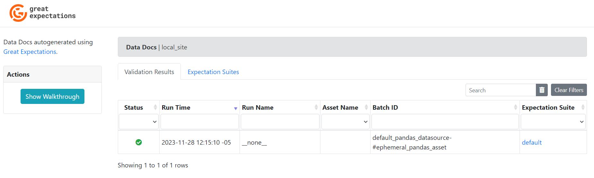
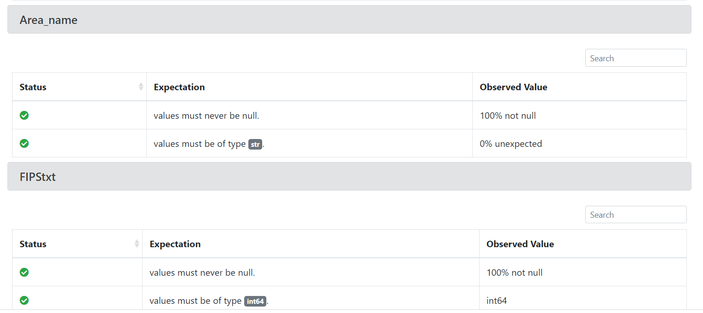
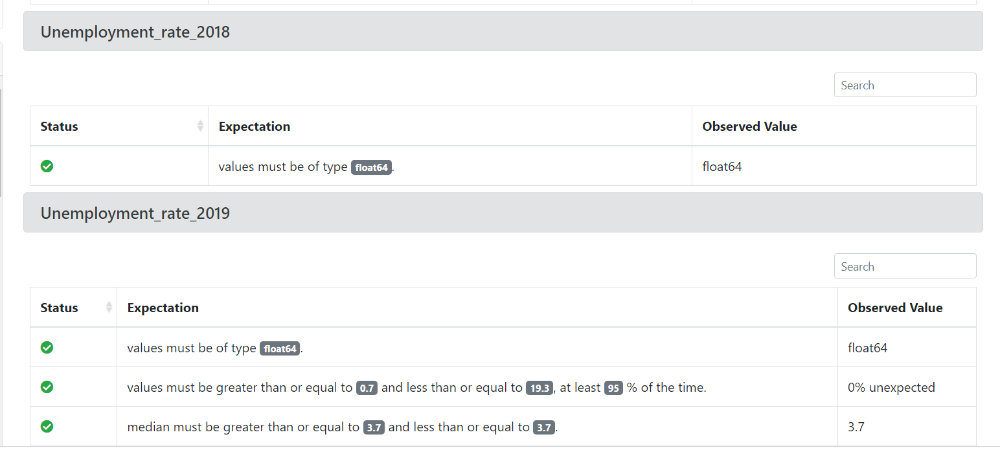
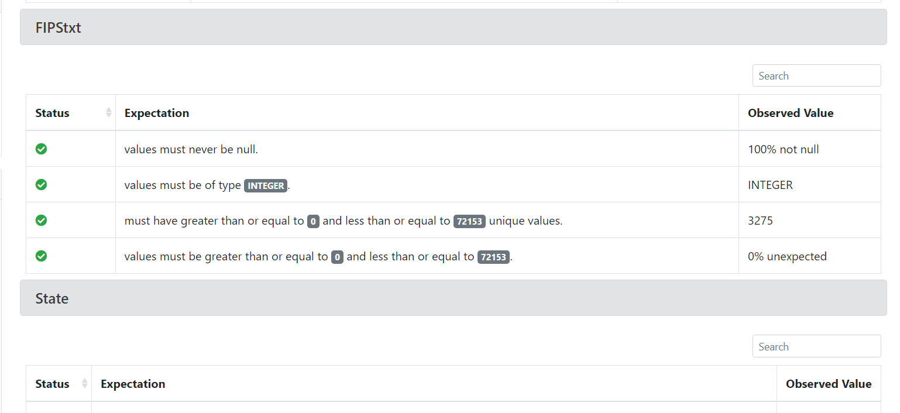

## What

This repo contains script for demonstrating a simple ETL data pipeline. Starting from extracting data from the source, transforming into a desired format, and loading into a SQLite file.

Then, perform simple analysis queries on the stored data. See: [analysis notebook](analysis.ipynb).

> Note: The used data is about the US population and unemployment rate over the past decade.


<hr>

## Getting started

First, make sure to have [Python 3.12](https://www.python.org/downloads/) installed

Then, install the project dependencies

```bash
pip install -r requirements.txt
```
> Note: preferable, run under a virtualenv 
> 
> ```
> $ python -m venv venv
> $ pip install -r requirements.txt
> ```

Second, run the main pipeline file

```bash
python pipeline.py
```

<hr>

## Requirements

- pandas
- xlrd (for reading excel file)
- Python >= 3.6


<hr>

## Data source and description


POPULATION BY METROPOLITAN AREA AND COUNTY


- cbsa-est2017-alldata.csv
	- data source:
		https://www.census.gov/data/tables/2017/demo/popest/total-metro-and-micro-statistical-areas.html#par_textimage
	- download link:
		https://www2.census.gov/programs-surveys/popest/datasets/2010-2017/metro/totals/cbsa-est2017-alldata.csv
	- dataset description:
		https://www2.census.gov/programs-surveys/popest/technical-documentation/file-layouts/2010-2017/cbsa-est2017-alldata.pdf


UNEMPLOYMENT BY COUNTY 


- Unemployment.xls
	- data source:
		https://catalog.data.gov/dataset/county-level-data-sets
		https://www.ers.usda.gov/data-products/county-level-data-sets/download-data
	- download link:
		https://www.ers.usda.gov/webdocs/DataFiles/48747/Unemployment.xls
	- description:
		see the sheet "Variable Descriptions" in the same `xls` file

## Expectations Test Results - Exercise 2
Before running any of these scripts please run the python pipeline.py to generate de db.sqlite

### gx_auto_unemployment_source_data_expects file 
Run the following command to generate the result for these expectations, 
this will generate a report for this auto generated expectation in a new page in your prefer browser
```bash
 python .\gx_auto_unemployment_source_data_expects.py
```
#### Results


### unemployment_source_data_expectations file 
Run the following command to generate the result for the source data expectations, 
this will generate a report for some expectations.
```bash
 python .\unemployment_source_data_expectations.py
```
#### Results









### gx_tests_unemployment_extracted_data_expects file 
Run the following command to generate the result for the extracted data expectations, 
this will generate a report for some expectations.
```bash
 python .\gx_tests_unemployment_extracted_data_expects.py
```
#### Results





## Expectations Test Results - Exercise 3
Run the following command to generate the result for the extracted data expectations, 
this will generate a report for some expectations.
```bash
 python ./unemployment_year_results_expectations.py 
```
